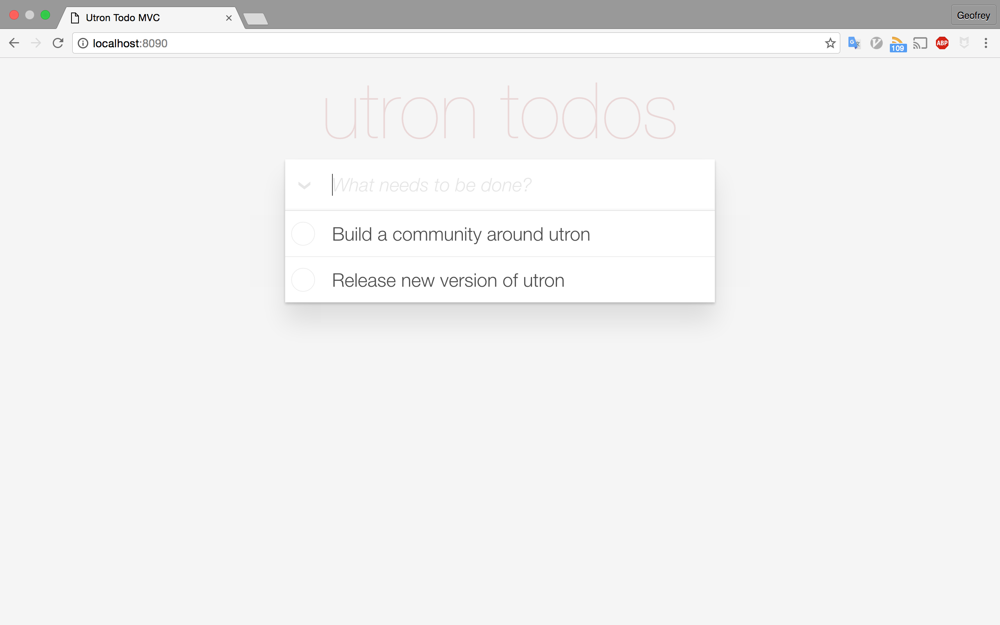

#utrontodo

Todo list application using [utron](https://github.com/gernest/utron)

This shows how you can get started using the utron web framework.

# Installation

You will need to have a working Go environment

``` bash
go get github.com/utronframework/todo
```


To run the applications, move to the root of the package
```
 cd $GOPATH/github.com/utronframework/todo
```

You can now edit `config/app.json` to suit your needs. The database is required,
so you can use a postgresql,mysql or sqlite database.

When you are happy with the configurations then you can run the application by
```
todo
```

Visit localhost:8080 if you didnt choose another port in the configuration file
to see your toto-list application


## ALternatively with docker-compose

If you have docker and docker-compose. There is a `docker-compose.yml` file that
will setup everything for you, like postgresql database and also build the app
for you.

```
git clone git@github.com:utronframework/todo.git

cd todo
docker-compose up -d
```

Visit localhost:8080 if you didnt choose another port in the configuration file
to see your toto-list application

#Shamless plug

If you find this helpful, please [follow the author](https://github.com/gernest)

# screen shot


nd start this project.

# LICENSE
MIT
